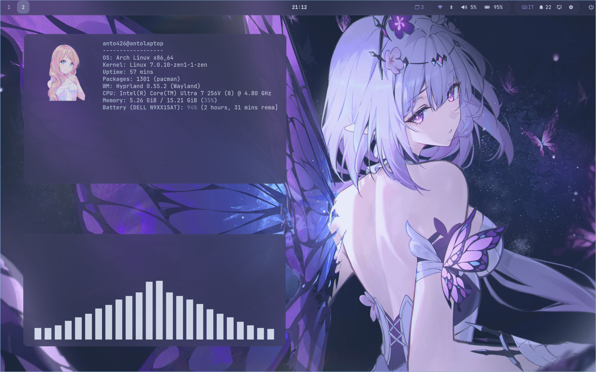

<p align="center">
  <a href="https://git.io/typing-svg"></a>
</p>

<p align="center">
  
</p>

#  About;

```sh
root@anto426: ~/arch-hyprland (main⚡)$ cat info.txt

A beautiful, automated installer to deploy a complete Wayland/Hyprland desktop ecosystem on Arch Linux.
This repository acts as the central bootstrapper, pulling down all aesthetic custom assets, custom themes,
dotfiles, and terminal packages to deliver a cohesive and jaw-dropping workspace right after login.
```

<p align="center">
  
</p>

#  Preview & Notes;

```sh
root@anto426: ~/arch-hyprland (main⚡)$ preview --status

> Previews & Screenshots:
  - 📽️ Demo Video: Playback player loaded below.
  - 📸 Screenshot: Active setup loaded successfully.

> Important System Notes:
  - ⚠️ Backup system beforehand; use on a clean minimal profile.
  - 🚫 Script does not uninstall packages to safeguard existing user setups.
  - 💡 Physical power button is configured to be ignored by systemd-logind.
  - ⌨️ Keybinding Hint: Press [SUPER + H] to open interactive bindings menu.
```

<p align="center">
  
</p>
<p align="center">
  
</p>

<p align="center">
  <a href="https://github.com/Arch-repo/Arch-Hyprland/blob/main/previews/demo.mp4">
    
  </a>
</p>


<p align="center">
  
</p>

#  Installation;

```sh
root@anto426: ~/arch-hyprland (main⚡)$ ./install.sh --help

Use this script to clone and install the environment on a clean Arch-based system:
```

```bash
git clone --depth=1 https://github.com/Arch-repo/Arch-Hyprland.git
cd ~/Arch-Hyprland
chmod +x install.sh
./install.sh
```

### 📂 Repository Targets

The installer manages and updates the following upstream targets:

```bash
DOTFILES_REPO=https://github.com/Arch-repo/dotfiles.git
WALLPAPER_REPO=https://github.com/Arch-repo/Wallpaper-Collection.git
ANTO_THEME_REPO=https://github.com/Arch-repo/Anto426-theme.git
ANTO_GRUB_THEME_REPO=https://github.com/Arch-repo/grub2-themes.git
ANTO_VSCODE_THEME_REPO=https://github.com/Arch-repo/vscodetheme.git
ANTO426_ROFI_REPO=https://github.com/Arch-repo/rofi
```

### 🎨 Integrated Sub-Themes

- 🖌️ **GTK Base Theme**: [`Anto426-theme`](https://github.com/Arch-repo/Anto426-theme) stable Orchard fork primary base.
- 🎛️ **Custom Rofi Menu**: [`rofi`](https://github.com/Arch-repo/rofi) Wayland fork enabling sliders.
- 🧩 **VSCode Integration**: [`vscodetheme`](https://github.com/Arch-repo/vscodetheme) exposing the dynamic theme file.
- 🗂️ **Boot Customization**: [`grub2-themes`](https://github.com/Arch-repo/grub2-themes) specializing in high DPI/resolution boots.

<p align="center">
  
</p>

#  Inspirations;

```sh
root@anto426: ~/arch-hyprland (main⚡)$ cat inspirations.log

- r/unixporn community styling
- JaKooLit/Hyprland-Dots structures
- Hyde-project/hyde wallpaper generation ideas
- mylinuxforwork/dotfiles packages and scripts
```

<p align="center">
  
</p>

<div align="center">
  <i>Configured by anto426</i>
</div>

